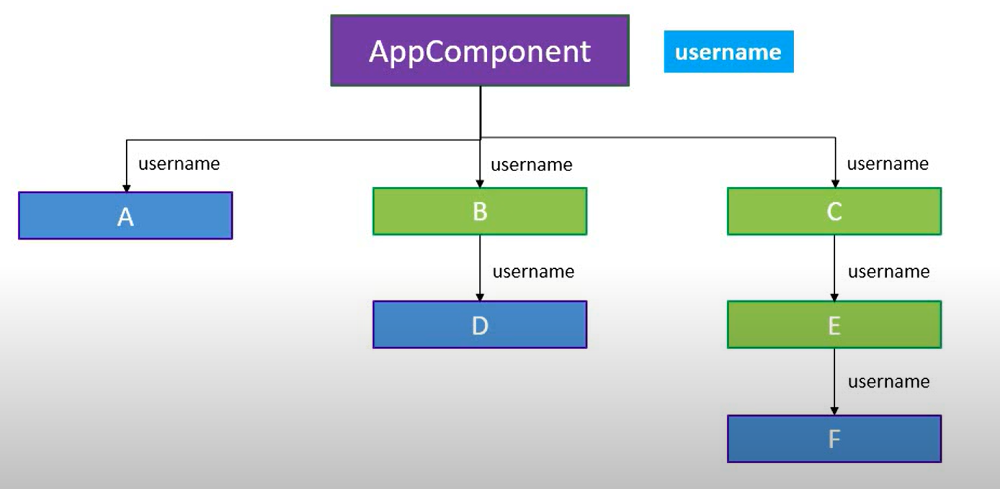
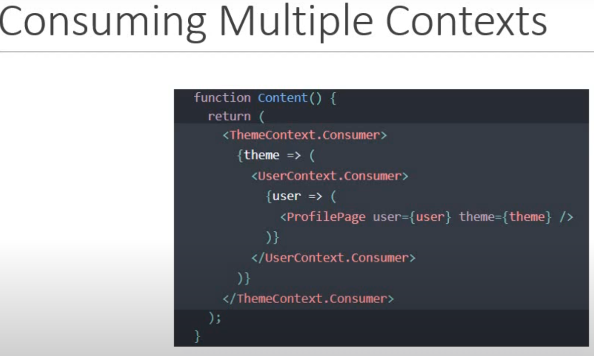

# Content

| No  | Topic                             |
| --- | --------------------------------- |
| 1   | [React Tutorial](#react-tutorial) |
| 2   | [React Hooks](#react-hooks)       |

# [React Tutorial](react-tutorial)

## Prerequisites

- HTML, CSS & Javascript fundamental
- ES6
- this keyward, map, filter and reduce
- let & const, Arrow function, template literals, default parameter, object literals, rest & spread operator & destructuring assignment

## Create a React project

```bash
npx create-react-app <project-name>
```

## Types of Components

### Stateless functional Components

```javascript
function Greet() {
    return <h1>functional component<h1>;
}

export default Greet;
```

### Stateful class component

```javascript
class Greet export Component {
    render() {
        return <h1>class component<h1>;
    }
}
export default Greet;
```

## Lifecycle Hooks in React

```javascript

class Greet extends Component{
    constructor() {
        this.state.count = 0;
    }

    increment() {
        this.setState((prevStat) => {
            prevStat.count =
        })
    }

    render() {
        return (
            <div>
                <h1>Count - {this.state.count}</h1>
                <button onClick={() => {this.increment}}>Increment<button>
            </div>
        );
    }
}
```

## Event Binding in React

```javascript
import React, { Component } from "react";

class EventBind extends Component {
  constructor(props) {
    super(props);

    this.state = {
      message: "Hello",
    };
  }

  clickHandler() {
    console.log(this);
    this.setState({
      message: "GoodBye",
    });
  }

  // Approach 1-2 is not recommended,, should go with approach 3/4

  // Approach 4 is the Arrow function
  //   const clickHandler = () => {
  //     this.setState({
  //       message: "GoodBye",
  //     });
  //   }
  render() {
    return (
      <div>
        <h1>{this.state.message}</h1>
        {/* Approach 1 */}
        <button onClick={this.clickHandler.bind(this)}>Approach 1</button>
        {/* Approach 2 */}
        <button onClick={() => this.clickHandler()}>Approach 2</button>
        {/* Approach 3 Binding clickhandler in the constructor */}
      </div>
    );
  }
}

export default EventBind;
```

## Methods as props Child to Parent Component

```javascript
class ParentComponent extends Component {
  constructor(props) {
    super(props);
    this.state = {
      parentName: "Parent",
    };

    this.greetParent = this.greetParent.bind(this);
  }

  greetParent(childName) {
    alert(`hello ${this.state.parentName} from ${childName}`);
  }

  render() {
    return (
      <div>
        <ChildComponent greetHandler={this.greetParent} />
      </div>
    );
  }
}

export default ParentComponent;
```

```javascript
class ChildComponent extends Component {
  constructor(props) {
    super(props);
  }

  render() {
    return (
      <div>
        <button onClick={() => this.props.greetHandler("Child")}>
          Greet Parent
        </button>
      </div>
    );
  }
}

export default ChildComponent;
```

## Conditional Element Rendering

```javascript
class UserGreeting extends Component {
  constructor(props) {
    super(props);

    this.state = {
      isLogged: true,
    };
  }

  render() {
    return this.state.isLogged ? (
      <div>Welcome Abdul Musavveer Alji</div>
    ) : (
      <div>Welcome guest</div>
    );
  }
}
```

## Looping Elements

```javascript
class ListElements extends Component {
  render() {
    const superHero = ["Bruce", "Clark", "Diana"];

    const persons = [
      { id: 1, name: "Bruce", age: 40, skill: "React" },
      { id: 2, name: "Clark", age: 34, skill: "Angular" },
      { id: 3, name: "Diana", age: 150, skill: "Vue" },
    ];

    const personsList = persons.map((person) => (
      <Person key={person.id} person={person} />
    ));

    return <ul>{personsList}</ul>;
  }
}
```

```javascript
function Person({ person }) {
  return (
    <li>
      Im {person.name}, Im {person.age} years old, i know {person.skill}
    </li>
  );
}
```

## Styling in React

### Inline Style

```javascript
import React from "react";

const style = {
  color: "blue",
};
function Inline() {
  return <h1 style={style}>Inline Style</h1>;
}

export default Inline;
```

### Stylesheet

```javascript
import React, { Component } from "react";
import "./StyleSheets.css";

class StyleSheets extends Component {
  render() {
    const isPrimary = this.props.isPrimary ? "heading" : "";
    return <h1 className={`${isPrimary} font`}>StyleSheets</h1>;
  }
}

export default StyleSheets;
```

```css
.heading {
  color: orange;
}

.font {
  font-size: 24px;
}
```

## Form Controller

```javascript
import React, { Component } from "react";

class Form extends Component {
  constructor(props) {
    super(props);

    this.state = {
      username: "",
      comment: "",
      topic: "React",
    };
  }

  usernameChangeHandler = (event) => {
    this.setState({
      username: event.target.value,
    });
  };

  commentChangeHandler = (event) => {
    this.setState({
      comment: event.target.value,
    });
  };

  topicChangeHandler = (event) => {
    this.setState({
      topic: event.target.value,
    });
  };

  onSubmit = (event) => {
    const { username, comment, topic } = this.state;
    alert(`${username} ${comment} ${topic}`);

    event.preventDefault();
  };

  render() {
    return (
      <form onSubmit={this.onSubmit}>
        <div>
          <label>Username : </label>
          <input
            id="username"
            value={this.state.username}
            onChange={this.usernameChangeHandler}
          />
        </div>
        <div>
          <label>Comment : </label>
          <input
            id="comment"
            value={this.state.comment}
            onChange={this.commentChangeHandler}
          />
        </div>

        <div>
          <label>Topic : </label>
          <select value={this.state.topic} onChange={this.topicChangeHandler}>
            <option value="React">React</option>
            <option value="Angular">Angular</option>
            <option value="Vue">Vue</option>
          </select>
        </div>

        <button type="submit">Submit</button>
      </form>
    );
  }
}

export default Form;
```

## Lifecycle Methods

Lifecycle methods are the methods which are rendered in a component in below orders, There are 4 Lifecycle phases. they are,

### Mounting

These methods are executed in order when the component is initialized

- `constructor(props)`
- `static getDerivedStateFromProps(props, state)`
- `render()`
- `componentDidMount()`

### Updating

These methods are executed in order when the component is updated

- `static getDerivedStateFromProps(props, state)`
- `shouldComponentUpdate(prevProps, prevState)`
- `render()`
- `getSnapshotBeforeUpdate(prevProps, prevState)`
- `componentDidUpdate(prevProps, prevState, snapshot)`

### Unmounting Phase

- `componentWillUnmount()`

### Error Handling Phase

- `static getDerivedStateFromError(error)`
- `componentDidCatch(error, info)`

## Fragment in React

Fragment tag lets u group elements without adding an addinational node/element to the DOM

```javascript
import React, { Component } from "react";

class FragmentDemo extends Component {
  constructor(props) {
    super(props);
  }

  render() {
    // Example 1: Can pass key props
    return (
      <React.Fragment>
        <h1>Fragment Demo</h1>
        <p>this is a fragment demo</p>
      </React.Fragment>
    );

    // Example 2: Cannot pass key props
    return (
      <>
        <h1>Fragment Demo</h1>
        <p>this is a fragment demo</p>
      </>
    );
  }
}

export default FragmentDemo;
```

## Pure Component & Regular Component

- we can create a component by extending PureComponent class
- A Pure component implements the `shouldComponetUpdate` lifecycle method by performing a shallow comparison on the props and state of the component
- if there is no difference then the component is not re-rendered - Performance Boost
- its is also a good idea to ensure the all the child components are also pure,, to avoid unexpected behaviour
- never mutate the state, Always return a new object that reflects the new state

## React Memo

We can memoize any component in React, to do so we just have to export the component in React.memo()

```javascript
export default React.memo(ComponentName);
```

## `React.createRef`

### Input Ref

```javascript
import React, { Component } from "react";

class RefDemo extends Component {
  constructor(props) {
    super(props);
    this.inputRef = React.createRef();
  }

  componentDidMount() {
    this.inputRef.current.focus();
    console.log(this.inputRef);
  }
  render() {
    return (
      <div>
        <input type="text" ref={this.inputRef} />
      </div>
    );
  }
}

export default RefDemo;
```

### Component Ref

```javascript
class ChildComp extends Component {
  constructor(props) {
    super(props);
    this.inputRef = React.createRef();
  }

  focusInput() {
    this.inputRef.current.focus();
  }
  render() {
    return (
      <div>
        <input
          type="text"
          ref={this.inputRef}
          placeholder="Child Component Ref"
        />
      </div>
    );
  }
}
```

```javascript
class ParentComp extends Component {
  constructor(props) {
    super(props);
    this.componentRef = React.createRef();
  }

  focusChildComp = () => {
    this.componentRef.current.focusInput();
  };
  render() {
    return (
      <div>
        <ChildComp ref={this.componentRef} />
        <button onClick={this.focusChildComp}>Focus on Child Input</button>
      </div>
    );
  }
}
```

### Ref Forwarding

```javascript
const ForwardRefDemo = React.forwardRef((props, ref) => {
  return (
    <div>
      <input ref={ref} />
    </div>
  );
});

export default ForwardRefDemo;
```

```javascript
class ParentForwardRef extends Component {
  constructor(props) {
    super(props);
    this.inputRef = React.createRef();
  }

  focus = () => {
    this.inputRef.current.focus();
  };
  render() {
    return (
      <div>
        <ForwardRefDemo ref={this.inputRef} />
        <button onClick={this.focus}>Focus</button>
      </div>
    );
  }
}

export default ForwardRefDemo;
```

## Portals

```javascript

function ReactPortal = () => {
    return ReactDOM.createPortal(
        <h1>Portal Demo<h1>,
        document.getElementById("portal-root")
    )
}
```

## Error Handling

```javascript
class Hero extends Component {
  render() {
    if (this.props.heroName === "Joker") {
      throw new Error("Joker is not a Hero");
    }
    return <div>{this.props.heroName} is a Hero</div>;
  }
}
```

```javascript
class ErrorHandle extends Component {
  constructor(props) {
    super(props);

    this.state = {
      hasError: false,
    };
  }

  static getDerivedStateFromError(error) {
    return {
      hasError: true,
    };
  }

  render() {
    if (this.state.hasError) return <h1>Something went wrong</h1>;
    return this.props.children;
  }
}

export default ErrorHandle;
```

```javascript
function App() {
  return (
    <div className="App">
      <ErrorHandle>
        <Hero heroName="Batman" />
        <Hero heroName="Superman" />
        <Hero heroName="Joker" />
      </ErrorHandle>
    <div>
  )
}
```

## High Order Components - HOC

```javascript
import React, { Component } from "react";
import updatedComponent from "./withCounter";

class Click extends Component {
  render() {
    const { count, increamentCount } = this.props;
    return <button onClick={increamentCount}>Clicked {count} Times</button>;
  }
}

export default updatedComponent(Click);
```

```javascript
import React, { Component } from "react";
import updatedComponent from "./withCounter";

class Hover extends Component {
  render() {
    const { count, increamentCount } = this.props;
    console.log(this);
    return <h1 onMouseOver={increamentCount}>Hovered {count} Times</h1>;
  }
}
export default updatedComponent(Hover);
```

```javascript
import React from "react";

const updatedComponent = (OriginalComponent) => {
  class NewComponent extends React.Component {
    constructor(props) {
      super(props);
      this.state = {
        count: 0,
      };
    }

    increamentCount = () => {
      this.setState((prevState) => ({
        count: prevState.count + 1,
      }));
    };
    render() {
      return (
        <OriginalComponent
          count={this.state.count}
          increamentCount={this.increamentCount}
        />
      );
    }
  }

  return NewComponent;
};

export default updatedComponent;
```

## Render Props

```javascript
 render() {
  return <Component
    name='Alji'
    born='1998'
    email={() => ('techie.alji@gmail.com')} />
 }
```

## [Context](react-context)



```javascript
import React from "react";

const userContext = React.createContext();

const ContextProvider = userContext.Provider;
const ContextConsumer = userContext.Consumer;

export { ContextConsumer, ContextProvider };
```

```javascript
import { ContextProvider } from "./UserContext";

class ComponentC extends Component {
  render() {
    return (
      <ContextProvider value="Alji">
        <ComponentE />
      </ContextProvider>
    );
  }
}
```

```javascript
class ComponentE extends Component {
  render() {
    return <ComponentF />;
  }
}
```

```javascript
import { ContextConsumer } from "./UserContext";

class ComponentF extends Component {
  render() {
    return (
      <ContextConsumer>
        {(username) => {
          return (
            <div>
              <h1>Component F</h1>
              <p>Value: {username}</p>
            </div>
          );
        }}
      </ContextConsumer>
    );
  }
}
```

### Example 2

You can pass any value in the parameter as a `default value`,

```javascript
import React from "react";

const userContext = React.createContext("Alji");

const ContextProvider = userContext.Provider;
const ContextConsumer = userContext.Consumer;

export { ContextConsumer, ContextProvider };
```

### Example 3

You can write the componentF from the 2nd example as below

```javascript
import React from "react";

const userContext = React.createContext("Alji");

const ContextProvider = userContext.Provider;
const ContextConsumer = userContext.Consumer;

export { ContextConsumer, ContextProvider };
export default userContext;
```

```javascript
import userContext from ".../userContext";
class ComponentF extends Component {
  static contextType = userContext;
  render() {
    return (
      <div>
        <h1>Component F</h1>
        <p>Value: {this.context}</p>
      </div>
    );
  }
}
```

**Limitations**

- This only works for class component
- can only pass single context where 1st example we can pass multiple context as props



## React and HTTP

it is not possible to make a `http Request` from react, but there are some libraries which helps us to make http calls using React, one of them is `Axios`

```bash
  npm install axios
```

### GET Api

```javascript
import axios from "axios";

class GetList extends Component {
  constructor(props) {
    super(props);

    this.state = {
      data: [],
      error: null,
    };
  }

  componentDidMount() {
    axios
      .get("https://jsonplaceholder.typicode.com/users")
      .then((response) => {
        console.log(response);
        this.setState({ data: response.data });
        this.setState({ error: null });
      })
      .catch((error) => {
        console.log(error);
        this.setState({ error: "Something went wrong" });
      });
  }
  render() {
    return (
      <div>
        <h1>getRequest</h1>
        {this.state.data.length
          ? this.state.data.map((user) => <p key={user.id}>{user.username}</p>)
          : null}

        {this.state.error ? <h1>{this.state.error}</h1> : null}
      </div>
    );
  }
}
```

### POST Api

```javascript
class PostUser extends Component {
  constructor(props) {
    super(props);

    this.state = {
      name: "",
      username: "",
      email: "",
    };
  }

  clickHandler = (event) => {
    this.setState({ [event.target.name]: event.target.value });
  };

  onSubmit = (e) => {
    e.preventDefault();
    axios
      .post("https://jsonplaceholder.typicode.com/users", this.state)
      .then((response) => {
        console.log("Post Respose", response);
      })
      .catch((error) => {
        console.log("Post Error", error);
      });
  };
  render() {
    return (
      <div>
        <form onSubmit={this.onSubmit}>
          <div>
            <label>Name : </label>
            <input type="text" name="name" onChange={this.clickHandler} />
          </div>

          <div>
            <label>Username : </label>
            <input type="text" name="username" onChange={this.clickHandler} />
          </div>

          <div>
            <label>Email : </label>
            <input type="text" name="email" onChange={this.clickHandler} />
          </div>

          <button type="submit">Create User</button>
        </form>
      </div>
    );
  }
}
```

# [React Hooks](react-hooks)

Hooks in react are not supported in class component

## UseState

```javascript
function HookCounter() {
  const [count, setCount] = useState(0);
  return <button onClick={() => setCount(count + 1)}>Count : {count}</button>;
}
```

### Use State with Previous state

```javascript
function HookCounterTwo() {
  const initalState = 0;
  const [count, setCount] = useState(initalState);

  const incrementFive = () => {
    for (let i = 0; i < 5; i++) {
      setCount((prevState) => prevState + 1);
    }
  };
  return (
    <div>
      <p>count : {count}</p>
      <button onClick={() => setCount(initalState)}>Reset</button>
      <button onClick={() => setCount(count + 1)}>Increment</button>
      <button onClick={() => setCount(count - 1)}>Decrement</button>
      <button onClick={incrementFive}>Increment by 5</button>
    </div>
  );
}

export default HookCounterTwo;
```

### Use State with Object

```javascript
function StateObject() {
  const [name, setName] = useState({ firstName: "", lastName: "" });
  return (
    <div>
      <input
        name={name.firstName}
        value={name.firstName}
        onClick={() => setName({ ...name, firstName: e.target.value })}
      />
      <input
        name={name.lastName}
        value={name.lastName}
        onClick={() => setName({ ...name, lastName: e.target.value })}
      />
    </div>
  );
}

export default HookCounterTwo;
```

### Use State with Array

```javascript
function StateObject() {
  const [items, setItems] = useState([]);

  const addItem = () => {
    setItems([
      ...items,
      {
        id: items.length,
        value: Math.floor(Math.random() * 10) + 1,
      },
    ]);
  };
  return (
    <div>
      <button onClick={addItem}>Add Item</button>
      <ul>
        {items.map((item) => (
          <li key={item.key}>item.value</li>
        ))}
      </ul>
    </div>
  );
}

export default HookCounterTwo;
```

## `useEffect`

- This hook is called on every render just like `componentDidUpdate` hook

```javascript
import React, { useEffect, useState } from "react";

function CountEffect() {
  const [count, setCount] = useState(0);
  useEffect(() => {
    document.title = `Button clicked ${count} times`;
  });
  return <button onClick={() => setCount(count + 1)}>Click : {count}</button>;
}

export default CountEffect;
```

### Example 2

- 2nd parameter of useEffect specifies that after every count update effect should render

```javascript
import React, { useEffect, useState } from "react";

function CountEffect() {
  const [count, setCount] = useState(0);
  const [name, setName] = useState("");
  useEffect(() => {
    console.log("Button clicked");
    document.title = `Button clicked ${count} times`;
  }, [count]);
  return (
    <div>
      <input value={name} onChange={(e) => setName(e.target.value)} />
      <button onClick={() => setCount(count + 1)}>Click : {count}</button>
    </div>
  );
}

export default CountEffect;
```

### useEffect cleanup

- `useEffect` still listens to the events even after you destroy/unmount your component
- useEffects 1st argument accepts function and same function can return another function to destroy the event as shown below

```javascript
function MouseHook() {
  const [x, setX] = useState(0);
  const [y, setY] = useState(0);

  const logMousePosition = (e) => {
    setX(e.clintX);
    setY(e.clintY);
  };
  useEffect(() => {
    window.attachEventListener("mousemove", logMousePosition);
    return () => {
      window.removeEventListener("mousemove", logMousePosition);
    };
  }, []);

  return (
    <div>
      X: {x}, Y: {y}
    </div>
  );
}
```

### HTTP Request using useEffect

- in the below example demonstrate how we can fetch a data on a button click

```javascript
import axios from "axios";
import React, { useEffect, useState } from "react";

function FetchData() {
  const [id, setId] = useState(1);
  const [post, setPost] = useState(null);
  const [isButtonClicked, setIsButtonClicked] = useState(1);

  useEffect(() => {
    axios
      .get(`https://jsonplaceholder.typicode.com/posts/${id}`)
      .then((res) => {
        console.log(res.data);
        setPost(res.data);
      })
      .catch((error) => console.log(error));
  }, [isButtonClicked]);

  const fetchData = () => {
    setIsButtonClicked(id);
  };
  return (
    <div>
      <input value={id} onChange={(e) => setId(e.target.value)} />
      <button onClick={fetchData}>Fetch Data</button>

      <p>{post?.title}</p>
    </div>
  );
}

export default FetchData;
```

### useContext

- We already have context explained above, Follow the link [Context](#react-context)

- talking about the `useContext` we can only use this hook to consume the data, providing logic will remain same

**_Example 1_**

```javascript
import { UserContext } from "./UserContext";

function ComponentF() {
  return (
    <UserContext.Consumer>
      {(username) => {
        return (
          <ChannelContext.Consumer>
            {(channel) => {
              return (
                <div>
                  <h1>Component F</h1>
                  <p>UserName: {username}</p>
                  <p>channel: {channel}</p>
                </div>
              );
            }}
          </ChannelContext.Consumer>
        );
      }}
    </UserContext.Consumer>
  );
}
```

- in above example we are using nested contexts we can write this in a much simpler way using `useContext` hook

**_Example 2_**

```javascript
import { UserContextConsumer, ChannelContextConsumer } from "./UserContext";

function ComponentF() {
  const username = useContext(UserContextConsumer);
  const channel = useContext(ChannelContextConsumer);

  return (
    <div>
      <h1>Component F</h1>
      <p>UserName: {username}</p>
      <p>channel: {channel}</p>
    </div>
  );
}
```

### `useReducer`

- Reducer is a state management hook in React

```javascript
import React, { useReducer } from "react";

const initialValue = 0;
const reduce = (state, action) => {
  switch (action) {
    case "increment":
      return state + 1;
    case "decrement":
      return state - 1;
    case "reset":
      return initialValue;
    default:
      return state;
  }
};
function CountReducer() {
  const [count, dispatch] = useReducer(reduce, initialValue);
  return (
    <div>
      <div>Count: {count}</div>
      <button onClick={() => dispatch("increment")}>Increment</button>
      <button onClick={() => dispatch("decrement")}>decrement</button>
      <button onClick={() => dispatch("reset")}>reset</button>
    </div>
  );
}

export default CountReducer;
```

### Reducer with Context

```javascript
try it by yourself
```

### Fetching API using reducer

```javascript
try it by yourself
```

### useCallBack & React.memo

```javascript
import React, { useCallback, useState } from "react";
import Title from "./Title";
import Count from "./Count";
import Button from "./Button";
function ParentComponent({ text, cb }) {
  const [age, setAge] = useState(25);
  const [salary, setSalary] = useState(1000);

  const increaseAge = useCallback(() => {
    setAge(age + 1);
  }, [age]);

  const increaseSalary = useCallback(() => {
    setSalary(salary + 1000);
  }, [salary]);
  return (
    <div>
      <Title />
      <Count text="Age" count={age} />
      <Button text="Age" cb={increaseAge} />
      <Count text="Salary" count={salary} />
      <Button text="Salary" cb={increaseSalary} />
    </div>
  );
}

export default ParentComponent;
```

### useMemo
- this hook is used to optimise performance,